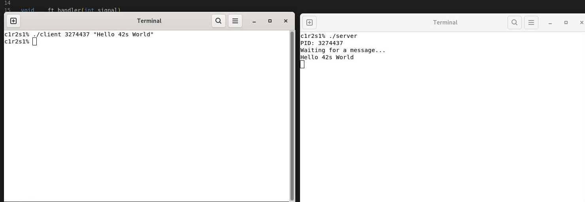

# 📡 SignalsTalk

## 🧾 Project Overview

`Minitalk` is a Unix-based communication project that demonstrates low-level interprocess communication (IPC) in C using Unix signals. It is simple client-server messaging system where the client sends a string message to the server, one bit at a time, using only signals (`SIGUSR1` and `SIGUSR2`).

## 🎯 Objective

- Implement a **server** program that:
  - Receives messages from clients using Unix signals
  - Reconstructs characters bit by bit
  - Displays the full message on standard output

- Implement a **client** program that:
  - Converts each character of a string into bits
  - Sends each bit to the server using `SIGUSR1` and `SIGUSR2`

## 💡 Key Concepts

- Interprocess communication (IPC) with Unix signals
- Bit manipulation and binary encoding
- Process IDs and signal handling in C
- Signal-based synchronization and reliability
- Handling asynchronous communication

## 🛠️ Technologies Used

- Language: C
- System calls: `kill()`, `signal()`, `pause()`, `usleep()`, `getpid()`
